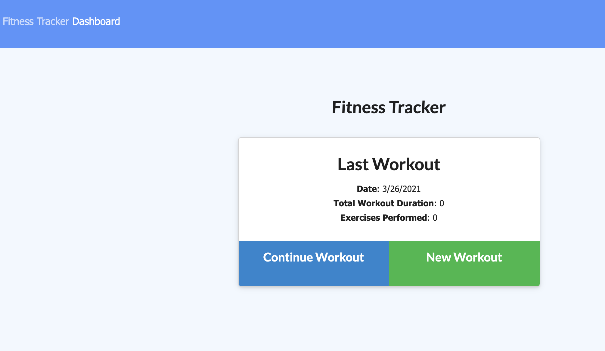
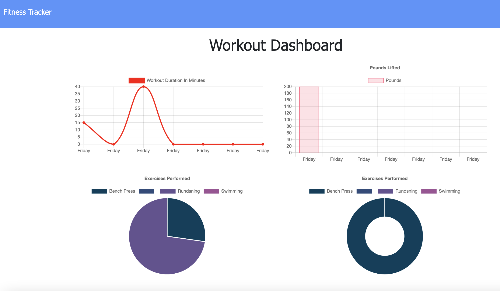

# Assignment17
This is the Repo for assignment 17, Fitness Tracker, Assignment 17, due March 11, 2021.

Submitted: March 25, 2021, Michael O'Connor, 604 765-6061

# 01 Goal: 

    The goal of this project is to create a workout tracker. I have already been provided with the front end code in the `Develop` folder. This assignment will require me to create Mongo database with a Mongoose schema and handle routes with Express. Here is a link to the Github folder https://emjayosee.github.io/17_Fitness_Tracker/
    and a link to the deployed website https://coachoffitness.herokuapp.com/.

# 02 Approach:

    In approaching the project, having done assignment 18 first, I used that as a base to setting up the required files to do the API / Routing and connections to Mongo DB. The assignment oproved tricky as I only realized now that I did not understand endpoints>  The TA helped me adjust, friom my converted assignment 18. server.js files and model files the correct referencing and modifications to ensure that the files loaded and opeated correctly. However, with this in mind, I still am worked towards meeting the requirements of the assignment, including ensuring that:

        1. When the user loads the page, the user should be able to:

            - create a new workout or continue with their last workout. [X]
            
            = Add exercises to the most recent workout plan. [X]

            - Add new exercises to a new workout plan. [X]

            - View the combined weight of multiple exercises from the past seven workouts on the `stats` page. [X]

            - View the total duration of each workout from the past seven workouts on the `stats` page.[X]

        2. Update GitHub repository [X]

        3. Deploy this site to Heroku [X]

# 03 Testing and Quality Control:

    1. Test each of the criteria to confirm functionality.

    2. Connect to MongoDB.
    
    3. Load the files and tested the page functionality at HEROKU.

# 04 Lessons Learned:

The following lessons learned:

    1. What an endpint is.

# 05 Further improvements to make:

The following items should be considered for future enhancements, time and budget permitting:

    1. Add excercises from a list.

    2. Add a way to clear the database.

# 06 Current Renderings:

See Current Rendering at the time of writing in the Assignment19 Repo. 

